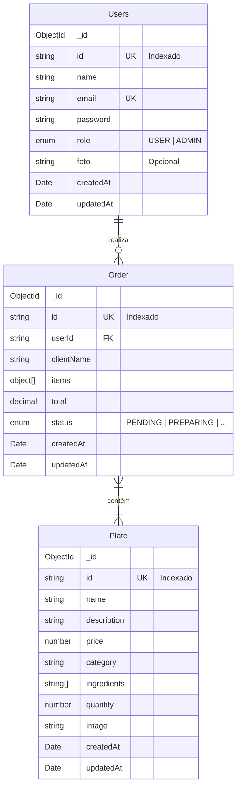

# 🍽️ My Gastronomy Backend

Bem-vindo ao repositório do backend do **My Gastronomy**. Esta é uma API robusta desenvolvida com **NestJS** para gerenciar um sistema de restaurante e delivery, oferecendo funcionalidades completas para gestão de usuários, pratos, pedidos e recomendações inteligentes via IA.

## 🚀 Sobre o Projeto

O **My Gastronomy Backend** foi projetado para ser a espinha dorsal de uma aplicação de entrega de comida. Ele gerencia todo o ciclo de vida do pedido, desde a autenticação do usuário até a entrega, passando pelo gerenciamento do cardápio. Além disso, integra-se com a **Google Gemini AI** para oferecer recomendações de harmonização de bebidas baseadas no prato escolhido pelo cliente.

### ✨ Principais Funcionalidades

-   **Autenticação e Usuários**:
    -   Cadastro de usuários e login (JWT).
    -   Controle de acesso baseado em cargos (Admin/User).
-   **Gestão de Cardápio (Pratos)**:
    -   CRUD completo de pratos (Nome, Descrição, Preço, Categoria, Ingredientes).
    -   Suporte para upload de imagens (URL).
-   **Gestão de Pedidos**:
    -   Criação de pedidos com múltiplos itens.
    -   Acompanhamento de status (Pendente, Preparando, Entregue, Cancelado).
    -   Cálculo automático de totais.
-   **IA Sommelier (Recomendações)**:
    -   Sugestão inteligente de bebidas para harmonizar com o prato escolhido, utilizando a API do Google Gemini.
-   **Documentação Interativa**:
    -   Swagger UI disponível para testar todos os endpoints.

## 🛠️ Tecnologias Utilizadas

O projeto utiliza um stack moderno e eficiente:

-   **[NestJS](https://nestjs.com/)**: Framework Node.js progressivo para aplicações server-side escaláveis.
-   **[TypeScript](https://www.typescriptlang.org/)**: Superset tipado de JavaScript.
-   **[MongoDB](https://www.mongodb.com/)**: Banco de dados NoSQL orientado a documentos.
-   **[TypeORM](https://typeorm.io/)**: ORM para interação com o banco de dados.
-   **[Google Generative AI](https://ai.google.dev/)**: Integração com Gemini para recursos de IA.
-   **[Swagger](https://swagger.io/)**: Documentação automática da API.
-   **[Jest](https://jestjs.io/)**: Framework de testes.

## 🧩 Modelo de Entidade e Relacionamento (MER)

Abaixo está o diagrama representando as principais entidades do sistema e seus relacionamentos.



> **Nota**: A relação entre `Order` e `Plate` é conceitual, armazenada através do array de itens (`items`) dentro do documento de Pedido no MongoDB (Desnormalização para performance).

## ⚙️ Pré-requisitos

Antes de começar, certifique-se de ter instalado em sua máquina:

-   [Node.js](https://nodejs.org/) (versão 18 ou superior recomendada)
-   [npm](https://www.npmjs.com/)
-   Uma instância do [MongoDB](https://www.mongodb.com/) rodando (local ou Atlas)

## 📦 Instalação e Configuração

1.  **Clone o repositório:**

    ```bash
    git clone https://github.com/Gabrieel03/MyGastronomy.git
    cd my-gastronomy-backend
    ```

2.  **Instale as dependências:**

    ```bash
    npm install
    ```

3.  **Configuração de Variáveis de Ambiente:**

    Crie um arquivo `.env` na raiz do projeto com base no exemplo abaixo:

    ```env
    # Exemplo de .env
    PORT=4000
    DB_HOST=localhost
    DB_PORT=27017
    DB_USERNAME=admin
    DB_PASSWORD=secret
    DB_DATABASE=my_gastronomy_db
    
    JWT_SECRET=sua_chave_secreta_jwt
    
    GEMINI_API_KEY=sua_chave_api_do_google_gemini
    ```

## ▶️ Executando o Projeto

Para iniciar o servidor em ambiente de desenvolvimento:

```bash
npm run start:dev
```

O servidor estará rodando em `http://localhost:4000` (ou na porta definida no `.env`).

### Outros comandos:

```bash
# Produção
npm run start:prod

# Testes Unitários
npm run test

# Testes E2E
npm run test:e2e
```

## 📚 Documentação da API

Após iniciar a aplicação, você pode acessar a documentação completa dos endpoints através do Swagger:

🔗 **URL do Swagger**: [http://localhost:4000/swagger](http://localhost:4000/swagger)

Lá você poderá ver os schemas de dados e testar as requisições (GET, POST, PATCH, DELETE) diretamente pelo navegador.

## 🤝 Contribuição

Contribuições são bem-vindas! Sinta-se à vontade para abrir issues ou enviar pull requests.

## 📝 Licença

Este projeto é [UNLICENSED](LICENSE).

---
Desenvolvido por **Gabriel Andrade** 🚀
